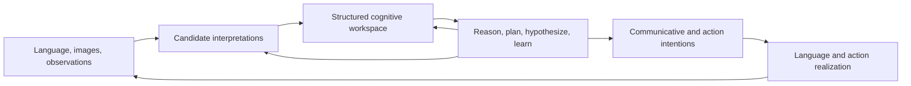

# 36 — The structured cognitive workspace

*2026-09-19. Architectural direction adopted from the owner's clarification. This document
sets the objective and acceptance criteria. It separates existing behavior, the first
implementation target, and subsequent work. It supersedes a planning-first interpretation
of [33](33-the-cognitive-fronts.md), [34](34-cognitive-primitives-and-implementation.md), and
[35](35-model-based-planning.md); their dated measurements and implementation reports remain
valid within their stated scope.*

The [first implementation report](37-interpretation-workspace-first-slice.md) describes
source/alternative retention, explicit selection and deferral, and remaining gaps. Its
historical reader-order default did not meet the full ambiguity-resolution target.
The subsequent checkpoint removes that default: language interpretations defer unless an
explicit policy selects them. Automatic evidence-driven resolution remains unfinished.
[Scene integration](38-scene-interpretations.md) extends this boundary to image evidence and
relational proposals; it does not yet infer general scene structure from pixels.
[39 — Removing implicit semantic authority](39-removing-implicit-semantic-authority.md) records
the removal of bundled knowledge defaults and downstream interpretation shortcuts. Earlier
default-English examples are historical, not current setup instructions.
[Evidence-driven investigation](40-evidence-driven-interpretation.md) now selects
discriminating observations for supplied candidate hypotheses and can withdraw an
earlier selection when fresh evidence contradicts it. Hypothesis generation and general
grounding inference remain open. [The chat workspace](41-chat-workspace-and-connections.md)
adds durable conversations, uploaded evidence, and independent connections. Those
transport and interface capabilities do not establish understanding of their inputs.
[Explicit grounding](42-explicit-grounded-identity.md) removes description-derived
identity from active assertions and questions, and prevents declaration order from
choosing among competing reporting actions. [Causal outcome retention](43-causal-outcome-uncertainty.md)
replaces a first-observed-outcome rule with empirical alternatives and paired evidence.
Both changes improve existing mechanisms while leaving general inference unfinished.
[Action evidence admission](44-action-observation-evidence.md) now retains raw
provider observations around actual invocations. [Transition learning](45-evidence-backed-transition-learning.md)
fits and validates rule proposals from those retained sources under explicit
measurement projections. This connects execution evidence to learning while keeping
learned rules separate from supplied measurements and action policies.
[Grounded goal execution](46-grounded-goals-without-lexical-reinterpretation.md)
removes plugin description resolution from requests and preserves exact supplied
role names across planning paths. It removes additional semantic guesses without
claiming to infer the goal specification itself from arbitrary input.
[Learned interpretation alternatives](47-learned-interpretation-alternatives.md)
exposes competing tag sequences, dependency trees, and per-occurrence preposition
roles to the workspace. Unknown relationships and colliding role projections remain
unresolved; production no longer repairs incomplete trees into apparent readings.
The proposals retain source anchors and model/search provenance. Their availability
does not establish grounded intent, and the dependency-to-meaning adapter still
contains authored semantic assumptions. The report distinguishes measured candidate
recall from an implemented policy capable of choosing a supported meaning.
[Planning from learned transitions](48-planning-from-learned-transitions.md) connects
validated induced outcomes to one-step comparison of supplied actions, guarded
execution, and independent observation of the result. Counterexamples suspend the
responsible rule. The verified FrozenLake slice uses authored state projections,
action candidates, and targets; general multi-step model construction remains open.
[Source-faithful language evaluation](49-source-faithful-language-evaluation.md)
compares retained syntax with original text through validated character spans,
separating partial alignment and attachment quality from meaning selection.
[Quotation boundary correction](50-quotation-boundaries-and-source-evidence.md)
removes a preprocessing shortcut that confused separate quoted phrases with one
whole-sentence mention. Preserving exact source content is a prerequisite for
revisable meaning; it does not itself supply a learned interpretation policy.
[Learned source segmentation](51-learned-source-segmentation.md) replaces the active
learned reader's authored clitic and quote-grouping tokenizer with trained boundary
proposals. Alternative segmentations keep their own source anchors through syntax,
selection, and evaluation; unavailable models leave unresolved evidence. Sentence
splitting, quotation meaning, and dependency-to-meaning projection remain authored.
[Global interpretation retention](52-global-interpretation-retention.md) allocates
one shared cap across distinct syntax families before projecting additional meaning
variants. Resumable semantic search exposes pending work and avoids projecting
excluded families. It does not supply a meaning-selection policy; dependency search
still runs eagerly, and pending reader searches do not survive across turns.
[Workspace continuation](53-resumable-workspace-interpretation.md) now retains that
semantic work across turns within one live agent. Bounded expansion publishes new
alternatives against the original evidence, withdraws stale selections, and permits
fresh investigation without reparsing or replaying actions. Restart persistence,
learned investigation scheduling, and autonomous hypothesis formation remain open.
[Investigation with pending interpretations](54-investigation-with-pending-interpretations.md)
connects bounded expansion to the supplied-hypothesis path before observation and
decision. Unexpanded alternatives block investigation-based commitment; missing
predictions remain unresolved rivals. This is an authored allocation policy, not
automatic hypothesis formation or a proof of semantic search completeness.
[Empirical model investigation](55-empirical-model-investigation.md) now derives
candidate-specific predictions from learned transition models for a shared probe.
It records forecasts before execution and compares them with the actual outcome,
preserving unknown rivals and model-applicability assumptions. Candidate bindings,
measurement projections, and available interventions are still supplied; the
assessment does not establish user intent or automatically select a meaning.
Observed minority outcomes remain in the empirical forecast alongside the dominant
label, so overlapping response evidence cannot manufacture a unique explanation.
[Contingent planning from experience](56-contingent-planning-from-experience.md)
extends execution-backed models beyond an immediate target. A finite graph retains
all measured successor states, and bounded planning composes paths that cover every
supported outcome. Execution checks one step against fresh evidence before another
plan is formed. State abstraction, goals, exploration, and action candidates remain
supplied; this does not yet infer a planning problem from language or images.
[Revision-bound empirical tasks](57-revision-bound-empirical-tasks.md) now retain
an explicit goal while a bounded loop replans after each observed step. Controlled
pauses resume from fresh evidence without replaying earlier actions. Corrections
stop further dispatch for the old goal, and delayed receipts stay attached to the
revision that authorized them. Inferring corrections or goal specifications from
language and scene evidence remains separate, unfinished work.
[Interpretation-dependent tasks](58-interpretation-dependent-tasks.md) now bind
task authorization to an exact selected reading and its comparison context.
Withdrawing that reading, adding rivals, or changing its search invalidates the
old dependency. Existing selected requests retain this link automatically; an
explicit fresh task revision is required to renew a changed commitment. This
guards an authored meaning-to-goal mapping rather than learning that mapping.
[Semantic preservation at the goal boundary](59-semantic-preservation-at-the-goal-boundary.md)
blocks known losses inside that mapping: ignored request polarity and other frame
qualifications, unmapped lexical roles, and qualified entities collapsing to bare
references. Rejection preserves an unresolved obligation; it does not supply a learned
interpretation of the missing semantics. Lexical sense/order and competing preposition
role mappings remain unresolved selection boundaries.
[Lexical goal interpretations](60-lexical-goal-interpretations.md) now retain the
competing resource frames and compatible role assignments rather than select by
lexical frequency or order. Execution requires a separate explicit goal policy,
including for a singleton; incomplete search cannot authorize a goal. Goal and
input-reading dependencies both constrain subsequent tasks. Projection semantics,
domain refinement, and justified interpretation selection remain unfinished.
[Deferred goal adoption](61-deferred-goal-adoption.md) develops the next lifecycle
boundary: an explicit later caller decision can revise the retained goal commitment
without reparsing its source or executing an action during adoption. This is distinct
from understanding a natural-language clarification or learning which goal was intended.
[Learning goal correspondences](62-learning-goal-correspondences.md) develops a bounded
learned projection from retained task supervision: exact non-reference structure with
induced reference substitutions, disjoint validation, and explicit model admission.
Frames, grounding, and teaching labels remain supplied. Model, reading, and goal choices
stay separate commitments; this does not establish generalized meaning-to-goal learning.

[Learning relational scene grounding](63-learning-relational-scene-grounding.md)
induces connected graph queries from structured descriptions and labeled scene
referents. This replaces a supplied binding rule within that bounded path while
retaining competing matches and model/scene dependencies. Scene construction and
teaching alignments remain supplied; this is not pixel-to-meaning inference.

[Active grounding investigation](64-active-grounding-investigation.md) develops
a next correction loop: retained learned queries predict different referents in
offered novel scenes, an authored policy identifies discriminating scenes, and
explicit teacher feedback supports a separately admitted refit. Scene acquisition,
conversational clarification, and autonomous learning policies remain unfinished.

[Conflicting scene evidence](65-conflicting-scene-evidence.md) addresses a concrete
consistency failure: exact opposite-polarity scene propositions now remain on
matching witnesses and block clean grounding or investigation commitments. Missing
facts and general open-world query evaluation remain unresolved.

## The objective

The agent should take unstructured inputs, including language and images, and develop a
highly structured internal account of what they might mean. Planning, open-ended reasoning,
hypothesis formation, and learning should operate on that account. The agent should then
form communicative or action intentions and realize them as language and interaction with
the world. Observed results return to the same reasoning process.

The central capability is **building and revising the structured problem being reasoned
about**. A planner that reliably solves a supplied specification is a component of this
architecture. Understanding how that specification relates to a user's words, an image,
prior conversation, and a changing world is part of cognition too.

This is an iterative process. Reasoning may discover that an initial reading is impossible,
that a visual referent is ambiguous, or that a missing observation would distinguish two
explanations. Those findings must change interpretation before the agent commits to an
unsupported action. Input adapters must not permanently settle every semantic question.

External actions need not be represented as unstructured strings. A typed filesystem call,
a pointer event, and generated language are different realizations. Keep precise executor
contracts where they are available. The objective concerns the movement between perceptual
or linguistic evidence and explicit meaning, rather than making every boundary textual.

## Where the current agent differs

The implementation at the start of this work has the following boundaries. A first workspace
slice must update its own implementation report without silently upgrading this baseline.

| Faculty | Existing behavior | Missing capability |
|---|---|---|
| Language interpretation | Grammar or learned dependency reader produces linguistic structures; conventions infer some requests | Persistent alternatives, context-sensitive disambiguation, grounded intent inference, and revision of the initial reading |
| Visual interpretation | A narrow classifier emits a selected category associated with an image | Holistic scene organization, relational visual graphs, events and affordances, competing scene explanations, and shared grounding with language |
| Representation | Frames, entities, claims, propositions, goals, and calls each carry useful structure | Explicit contracts for translating meaning between them and a common account of evidence, identity, scope, and revision |
| Planning | Bounded search over supplied grounded actions, preconditions, and effects; actual effects are checked | Constructing or learning the model, inventing useful abstractions, and reasoning beyond the supplied candidate set |
| Hypotheses | Unknown conditions and some provenance are represented | Generating competing explanations, making their predictions explicit, and choosing observations that discriminate between them |
| Learning | Separate learning and trained perception/parsing components exist | An active agent loop that revises concepts, interpretations, action models, and strategies from experience |
| Output | Structured calls reach executors; grammar and templates produce replies | Planning what to communicate, choosing supported claims, adapting an explanation to the question, and realizing that content coherently |

The [planning milestone](35-model-based-planning.md) improved important guarantees. It did
not establish general language understanding. “Make a python project called hello” reaches
a supplied project recipe; the original “make a python hello world project” can be parsed
incorrectly before planning starts. Correct execution of the resulting specification would
not prove that it captured the user's intent.

Likewise, preserving modifiers prevents some information loss, but does not by itself
resolve their attachment or meaning. Moving request conventions and project refinements
from Python into JSON makes authored knowledge inspectable and replaceable. It does not
make that knowledge learned. Tests of a convention establish its behavior within the tested
scope; they are not evidence that the agent acquired the concept.

The visual path also commits too early. Its classifier chooses a label, but the emitted
claims do not carry the full alternative distribution. A common claim interface therefore
does not yet imply shared multimodal understanding. The same identifier shape for a visual
object and a mentioned object is insufficient to establish that they refer to the same thing.

## Vision means understanding a scene

**Owner clarification, 2026-09-19:** visual cognition includes holistic scene understanding
and visual graph structuring. Element identification and classification are supporting tasks;
they do not define the objective. A scene interpretation should explain how the visible parts
form a situation, which relationships matter, and what the scene makes possible or rules out.

The target encompasses:

- **Global organization:** layout, composition, grouping, nested regions, background and
  foreground, occlusion, and the relationship of local evidence to the whole scene.
- **Relational structure:** spatial, functional, semantic, and task-relevant relationships
  among entities, regions, groups, and events. Relations may involve more than two things.
- **Situation and affordances:** what is happening, what might happen next, what actions
  appear possible, and which evidence or assumptions support those judgments.
- **Alternative explanations:** different global organizations can explain the same pixels.
  Retain competing graphs, unresolved correspondences, and uncertain boundaries instead of
  forcing every ambiguity into independent object labels.
- **Cross-modal grounding:** language may refer to a relation, region, event, arrangement,
  or entire situation. Grounding extends beyond matching mentioned nouns to detections.
- **Dynamics and active viewing:** later work must account for change, identity over time,
  viewpoints, occlusion, and observations chosen to discriminate scene hypotheses.

These are semantic requirements, not a required closed list of node or edge categories.
Use extensible propositions and shared reference/evidence mechanics. A scene may have a
whole-scene referent, group referents, and source-anchored regions without assigning each one
a fixed object taxonomy. Preserve original pixels so new interpretations can revisit them.
Bounding boxes are useful anchors when available; they are neither a complete representation
of visual structure nor a prerequisite for every scene-level assertion.

For example, two screenshots can contain identical labels and controls while grouping them
into different projects or placing one set inside a modal overlay. The interpretation must
capture which controls belong together, which layer is active, and how that changes a request
such as “continue the other project.” Recognizing all labels can still yield the wrong action
if the global organization is misunderstood. A non-desktop scene should use the same evidence
and interpretation contracts without being forced into a UI element schema.

There are three separate achievements to report: storing a supplied scene graph, consuming
that graph in reasoning, and deriving a useful graph from unfamiliar visual input. A supplied
graph test establishes only the first two when its consumer is actually exercised. The narrow
installed image classifier and historical desktop perception experiments do not establish
broad learned scene understanding. The first scene integration should preserve and inspect
supplied relational hypotheses; learned scene formation remains an explicit open requirement.

## Structure must include unsettled meaning

A structured workspace must represent ambiguity as faithfully as it represents a conclusion.
Examples include two candidate meanings of “same,” an object whose identity is unresolved,
a goal with incomplete success criteria, and an action model supported by only a few trials.
An unresolved slot is meaningful state, not permission to fill it with a convenient default.

The following distinctions must survive even when concrete record types evolve:

- **Evidence and interpretation.** Preserve the original utterance, image, or observation,
  and identify the source span, region, or event supporting each proposed interpretation.
  An interpretation is not a new direct observation.
- **Candidate and commitment.** A candidate can be considered without being believed or
  authorized for execution. Selecting one must leave the alternatives and rationale
  inspectable. Selection can later be revised.
- **Belief and hypothesis.** A hypothesis has premises, predictions, and possible
  counterevidence. A confidence field alone does not provide these relationships.
- **Goal and prediction.** Desired outcomes do not become believed facts. A simulated
  effect is distinct from an observed effect.
- **Task, interpretation, plan, and attempt.** A revised interpretation may invalidate a
  plan while the task and its real execution history persist.
- **Unknown, unsupported, and contradicted.** Missing evidence, a representation that cannot
  express a demand, and evidence against that demand require different follow-up work.
- **Observation and learned generalization.** One successful execution can support an
  example without establishing that an action model generalizes.

An early implementation need not encode all of these in one enormous record. It must avoid
interfaces that make later distinctions impossible or silently collapse them. The workspace
can coordinate existing stores and typed structures through explicit relationships.

## Stable mechanics, extensible knowledge

The stable core should provide identity, references, evidence attachment, alternatives,
dependencies, scope, revision, and execution boundaries. These mechanics allow representations
to be compared and corrected. They do not require a permanently closed vocabulary of every
concept the agent may encounter.

Domain concepts such as “Python project,” “meeting,” “folder,” or “promise” should have
inspectable definitions and models. They may initially be supplied by a person or a library.
Their provenance must say so. Later, the agent should be able to propose extensions, test
their consequences, and retain counterexamples. Adding a new domain concept should usually
extend knowledge, rather than add a branch to the central agent loop.

Extensibility does not mean arbitrary predicates are automatically understood. A new relation
needs usable semantics: what observations support it, what follows from it, how it interacts
with scope or time, and what operations can consume it. A name alone is a storage facility.

Useful fixed rules remain: executors validate arguments, receipts distinguish effects from
failures, and evidence records preserve provenance. Rules become brittle when they silently
settle meaning without representing their assumptions or permitting revision. Audit semantic
commitments at these boundaries before counting the number of dictionaries or dataclasses.

## Semantic contracts between representations

Every important translation should state its semantic contract. The contract must describe:

1. The source information it can preserve, including entity identity and references.
2. The interpretation choices or assumptions it introduces.
3. The information it omits or cannot express.
4. The evidence or source anchors needed to revisit those choices.
5. Which downstream uses remain valid after those losses or assumptions.

This applies to text-to-frame, image-to-scene-hypothesis, scene-to-proposition,
frame-to-proposition, interpretation-to-goal,
goal-to-plan, and intention-to-output. Loss reporting is a useful starting point, but a log
entry alone does not repair a lossy conversion. The consumer must either preserve access to
the richer source, request a suitable representation, or decline the affected inference.

Quantity, negation, modality, temporal scope, conditional structure, causal relations,
reference, and user constraints are behavioral obligations. For example, projecting “keep
the existing README” into an unqualified final-state existence condition loses the requirement
that intermediate actions preserve it. A reader accepting every word has not demonstrated
that these obligations reached execution.

Different modalities should share identity and evidence contracts without being forced into
identical payloads. Image regions and linguistic spans need different anchors. A shared
entity may have both, with an explicit correspondence hypothesis and its supporting evidence.
Retaining an opaque source fragment is better than inventing a meaning; it remains an
unresolved interpretation problem that the agent should be able to return to.

## Interpretation is an active reasoning process

The desired loop is:

1. Produce candidate interpretations with source anchors and declared assumptions.
2. Compare candidates with context, observed state, and current task commitments.
3. Identify consequential differences and what evidence would distinguish them.
4. Inspect, ask, simulate, or perform a suitable experiment when additional evidence helps.
5. Commit only to the degree supported, retaining unresolved alternatives where necessary.
6. Reopen a commitment when later observations or corrections undermine its dependencies.

A reader ranking may help allocate attention; it is not automatically a probability of user
intent. A top-ranked candidate must not gain authority merely because it appears first.
Conversely, several syntactically different candidates can express the same consequential
meaning. Future selection should reason about that equivalence rather than treating every
parse difference as requiring a user question.

No semantic equivalence solver or calibrated interpretation policy is claimed here. Initially,
explicit caller selection can make the boundary inspectable. It is a mechanism for recording
a decision, not evidence that the agent learned to choose correctly.

## Hypothesis formation and learning belong in the same loop

For an explanation or model hypothesis, the workspace should retain the observations it
explains, its premises, predictions, and competing accounts. An experiment has a purpose:
it should distinguish accounts or reduce uncertainty relevant to the task. Its result may
support a model, leave the issue unresolved, or supply a counterexample.

Different learning events require different changes. Resolving a reference for one utterance
must not silently redefine a word. Correcting a belief about a particular file must not rewrite
all filesystem action models. Learning a reusable project construction method requires evidence
about which parts vary and which conditions its success depends on.

The initial goal is a bounded loop with one inspectable proposed model, a distinguishing test,
and a recorded revision. General open-ended model learning remains a later objective. Do not
substitute a pre-enumerated answer table and describe the lookup as hypothesis formation.

## Communicative intentions and action realization

The agent should decide what its output is meant to accomplish before deciding how to phrase
or execute it. Answering a question, explaining a decision, requesting missing information,
and changing a file have different success criteria.

An explanation should connect a choice to evidence, assumptions, rejected alternatives, and
remaining uncertainty. A trace can supply those facts, but dumping trace events does not
ensure that the user's question has been answered. A communicative plan should identify the
claims to convey and the evidence licensing them; realization supplies wording and presentation.

Action realization should retain the existing distinctions among proposed calls, attempted
calls, receipts, and verified effects. New interpretation machinery must not bypass these
contracts. A changed interpretation after partial execution requires replanning from observed
state, rather than replaying a previous plan or assuming the world has been reset.

## Implementation sequence and behavioral gates

These are dependency-aware milestones, not claims that a single new workspace class completes
the architecture. Each milestone needs an end-to-end agent path and a failure case.

### 1. Preserve and revise interpretation alternatives

**First implementation target:** retain the source and alternatives supplied by a reader in
an inspectable workspace. Make selection explicit and revisable, with its history. The agent
must distinguish unresolved alternatives from a selected interpretation before dispatching
an external action. Readers that provide only one candidate must be identified as such;
one candidate is not proof that an input has only one meaning.

Acceptance criteria:

- An ambiguous input retains distinct reader candidates and the original source.
- Merely inspecting candidates causes no external effect.
- Unresolved alternatives do not silently execute the first candidate.
- Selecting a candidate uses that candidate; revising selection preserves earlier decisions.
- Invalid selection fails explicitly and does not corrupt the prior selection.
- A regression demonstrates behavior through the agent interface, in addition to record tests.

This slice does not promise new parser coverage, learned ranking, exact token anchors from
readers that lack them, durable storage, visual grounding, or automatic natural-language task
correction. Record exactly which of these remain absent in the implementation report.

### 2. Preserve meaning across the active path

Connect source, interpretation, goal refinement, and task records through explicit dependencies.
Exercise quantities, negation, modifiers, reference, and preservation constraints. A deliberately
lossy adapter must expose the affected obligation and prevent unsupported success claims.
Equivalent paraphrases should reach equivalent task commitments; consequentially different
wording should produce a visible difference or an unresolved issue.

### 3. Use evidence to resolve an interpretation

Add a bounded policy for comparing candidates against context and fresh observations. One
behavioral episode should resolve an ambiguity by inspecting the environment. Another should
remain unresolved because the available evidence cannot distinguish the candidates. Neither
should rely on a whole-phrase dispatch rule. Measure needless clarification as well as wrong
commitments and unsupported action.

### 4. Understand scenes and ground across language and images

Retain relational scene hypotheses in the shared workspace, including whole-scene structure,
local source anchors, and unresolved organization. Link a linguistic reference to a scene,
region, relation, event, or entity through an inspectable correspondence. Test multiple similar
objects, conflicting layout cues, missing referents, and changed scenes. Preserve alternative
global explanations as well as identity hypotheses.

Acceptance must include a pair of scenes with the same element inventory but different
relationships or organization that require different reasoning or action. Test a global
hypothesis that remains unresolved and does not enter the belief store as fact. Include a
non-UI relational scene to expose accidental dependence on desktop-specific categories.
Report whether scene graphs were supplied or inferred from pixels; controlled supplied-graph
integration tests cannot substitute for held-out perception evaluation. Later checkpoints
must test temporal change and an actively chosen observation that resolves scene ambiguity.

Success requires the relational interpretation to change downstream behavior correctly.
Storing labels, regions, or a graph without an active consumer does not meet this gate.

### 5. Form, test, and revise a model

Run a task in which an unknown relationship matters, at least two explanations make different
predictions, and an observation distinguishes them. Record the prediction before the test.
Retain the counterexample and show that revision changes later behavior. Test transfer to a
new instance and failure outside the model's supported conditions.

### 6. Realize grounded communication and reusable methods

Explain a decision using actual alternatives and evidence. Apply a learned or supplied method
to a different object while preserving its preconditions and the user's constraints. Revise a
running task from a conversational correction without losing identity or repeating completed
mutations. These require the earlier interpretation and dependency work; copying old arguments
or echoing a request does not meet the criteria.

## The running acceptance episode

Use the following family of interactions to keep integration concrete:

> Make a hello-world project in scratch.
> Actually, use Documents, but keep the existing README.
> Why did you choose that file?
> Do the same for the other project.

Extend it with screenshots showing candidate destinations or projects and competing layouts.
Include scenes with identical labels but different grouping, containment, or active overlays.
Vary names, sentence
structure, object counts, existing contents, and the time at which the correction arrives.
Include ambiguous and impossible cases. The test should separately judge interpretation,
constraint preservation, execution, explanation, and learning. A correct final file layout
cannot compensate for silently discarding a constraint or fabricating the reason for a choice.

The original failing wording remains a useful regression, but optimizing only that phrase
would defeat the objective. Add held-out paraphrases and nearby counterexamples. Report the
reader, resource versions, authored knowledge, supplied action models, and external assistance
used in each run. Test counts measure verification effort; they are not cognitive scores.

## Work that must not be mistaken for the objective

The following may support progress but do not establish the target capability by themselves:

- Adding more record types without an active consumer that changes behavior.
- Treating object detection or a list of labels as complete scene understanding.
- Evaluating supplied scene graphs and claiming the agent inferred them from pixels.
- Exposing a cognitive module through an import without connecting it to the agent loop.
- Moving a phrase matcher or domain recipe from code into a configuration file.
- Increasing planner depth while the interpreted problem is wrong.
- Reporting ambiguity after already executing one unsupported interpretation.
- Attaching a confidence number without a defined meaning or validation.
- Keeping source text in a trace that cannot influence a later revision.
- Producing a fluent explanation disconnected from the evidence used to decide.

For each implementation checkpoint, state which semantic commitment became inspectable or
revisable, which new behavior actually uses it, and which adversarial example now behaves
correctly. Preserve the narrower claims of previous milestones. The objective remains an
agent that can construct, examine, and improve its account of a situation while acting in it.
